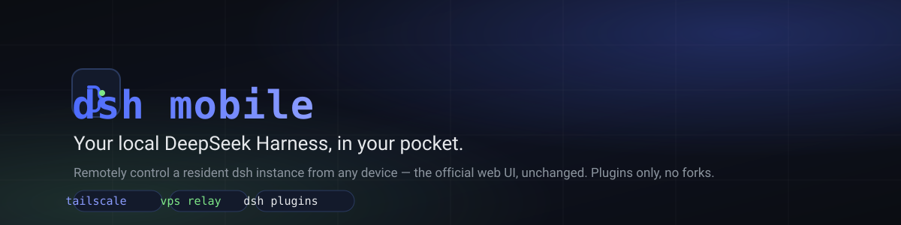

<div align="center">



# `dsh` Mobile

### Control your local [DeepSeek Harness](https://github.com/deepseek-ai/deepseek-harness) from any remote device

[](LICENSE)
[](https://nodejs.org)
[](https://github.com/topics/dsh-plugin)
<!-- [](CONTRIBUTING.md)
[](https://github.com/BB-84C/deepseek-harness-mobile-solution/stargazers) -->


</div>

---

This project adds a remote control plane and two transports:

- **Tailscale** — point-to-point over your tailnet.
- **VPS relay** — If you happen to have your own VPS, use your VPS as relay. One relay, many machines, one menu.

Both serve the same thing: the official dsh web UI through an authenticating gateway.

## Install

This is a **dsh plugin** — installed with the stock plugin manager, controlled through one entry point:

```sh
# one command (recommended)
dsh --profile mobile install
```

```sh
# or add the two plugins directly
dsh plugin --profile mobile add @bb-84c/dsh-mobile-cli
dsh plugin --profile web    add @bb-84c/dsh-mobile-server
```

Everything lives behind **`dsh --profile mobile`** — `service`, `tailscale`, `relay`, `device`, `config`, `status`, `doctor`, `logs`, `update`, `uninstall`.

| Package | Profile | Role |
| --- | --- | --- |
| `@bb-84c/dsh-mobile-cli` | `mobile` | command family |
| `@bb-84c/dsh-mobile-server` | `web` | gateway + transports + session hydration |

📖 [`docs/plugin-install.md`](docs/plugin-install.md)

## Features

- One entry point: `dsh --profile mobile <command>`
- Official UI, unchanged — official updates reach your phone automatically
- Device auth: one-time pairing codes, token hashes only, instant revocation
- Live streaming over SSE/WS, tunneled end-to-end
- Instance menu at your relay domain
- One resident instance enforced; pidfile-guarded stop/restart
- Three-OS scripts, auto-start templates
- 144+ offline tests

## How it works

```
phone / browser
   │
   ├─ tailscale ──────────────────────────────┐
   │                                          ▼
   └─ https://<relay>/instance/<id>/ ─▶ relay ─▶ tunnel ─▶ gateway (device auth, :3081) ─▶ dsh web (:3080)
```

- dsh web stays loopback-only, as shipped.
- The gateway plugin lives inside the same dsh process and proxies the official UI.
- The relay is a standalone zero-dependency Node service. It stores credential hashes and a machine directory — never session data.

## Modes

### Tailscale

```sh
dsh --profile mobile tailscale connect
dsh --profile mobile tailscale start
dsh --profile mobile device pair --name iPhone
dsh --profile mobile url
```

📖 [`docs/deployment/tailscale.md`](docs/deployment/tailscale.md)

### VPS relay

```sh
dsh --profile mobile relay connect https://relay.example.com --token <instance-token>
dsh --profile mobile relay start
dsh --profile mobile device pair --name iPhone
```

Open `https://relay.example.com`, pick a machine, pair, done.

📖 [`docs/deployment/relay.md`](docs/deployment/relay.md)

## For dsh agents

Setting this up for a user? Read in order, then execute:

1. [`docs/plugin-install.md`](docs/plugin-install.md) — install the plugins.
2. [`docs/deployment/tailscale.md`](docs/deployment/tailscale.md) or [`docs/deployment/relay.md`](docs/deployment/relay.md) — set up a transport. Relay mode also needs the relay on a VPS (`scripts/relay-deploy`).
3. [`docs/commands.md`](docs/commands.md) — command reference.
4. Pair: `dsh --profile mobile device pair --name <name>`. Verify with [`docs/acceptance.md`](docs/acceptance.md).

Rules:

- Never patch the shipped `@deepseek-ai/*` packages.
- Exactly one resident dsh web instance per `$DSH_HOME`.
- Stop/restart only through the CLI.
- Keep tokens out of logs and chat.
- After an official dsh upgrade, run [`docs/research/upstream-touchpoints.md`](docs/research/upstream-touchpoints.md).

## Repository

```
├── packages/
│   ├── dsh-mobile-cli/        # dsh plugin: command family
│   ├── dsh-mobile-server/     # dsh plugin: gateway + tunnel + hydration
│   ├── dsh-mobile-common/     # shared library
│   └── dsh-relay/             # standalone relay service
├── scripts/                   # installers, deploy, probe, repair, autostart
├── docs/                      # guides, deployment, research, specs
└── assets/                    # artwork
```

## Security

- Web server stays loopback-only; the gateway is the only network surface.
- Tailscale mode rides WireGuard; relay mode is HTTPS behind Caddy.
- Pairing codes are single-use, 5-minute expiry. Tokens are stored hashed, verified in constant time, revoked instantly.
- Relay stores credential hashes and a public directory only.

## Documentation

| Doc | Audience |
| --- | --- |
| [`docs/plugin-install.md`](docs/plugin-install.md) | users |
| [`docs/commands.md`](docs/commands.md) | users |
| [`docs/deployment/service.md`](docs/deployment/service.md) | users |
| [`docs/deployment/tailscale.md`](docs/deployment/tailscale.md) | users |
| [`docs/deployment/relay.md`](docs/deployment/relay.md) | users |
| [`docs/acceptance.md`](docs/acceptance.md) | users & agents |
| [`docs/plan.md`](docs/plan.md) | project |
| [`docs/research/`](docs/research/) | project & agents |
| [`docs/specs/`](docs/specs/) | app implementors |

## Requirements

- A machine running [DeepSeek Harness](https://github.com/deepseek-ai/deepseek-harness) that stays online.
- Node.js ≥ 22.
- Tailscale **or** a small VPS.

## License

MIT — see [LICENSE](LICENSE).
