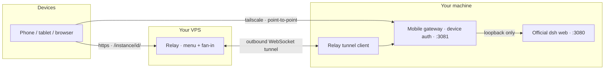

<div align="center">


# dsh mobile

### Remotely control your locally resident [DeepSeek Harness](https://github.com/deepseek-ai/deepseek-harness) (`dsh`) from any device — phone, tablet, or another computer — with the **official dsh web UI, unchanged**.

[](LICENSE)
[](https://nodejs.org)
[](https://github.com/topics/dsh-plugin)
[](https://github.com/BB-84C/deepseek-harness-mobile-solution/actions/workflows/ci.yml)
[](CONTRIBUTING.md)
[](https://github.com/BB-84C/deepseek-harness-mobile-solution/stargazers)

<sub>Community project — not affiliated with DeepSeek. "DeepSeek Harness" and "dsh" refer to [deepseek-ai/deepseek-harness](https://github.com/deepseek-ai/deepseek-harness).</sub>

</div>

---

Your `dsh` stays on your home/office machine. **dsh mobile** adds a remote control plane as **dsh plugins** — no fork, no patched binaries, no wrapper around the launcher — and gives you two ways to reach it:

- **Tailscale (point-to-point)** — encrypted WireGuard path inside your own tailnet. Nothing touches the public internet.
- **VPS relay (fan-in)** — many machines register with one small relay you control; any device picks a machine from a menu and connects.

Both transports land on the same surface: **the official dsh web UI**, served through an authenticating gateway. What the official UI gains upstream, you gain on your phone — free.

## ✨ What you get

- 🕹️ **One entry point** — everything behind `dsh --profile mobile <command>` (the stock `--profile` mechanism, nothing custom).
- 🖥️ **Official UI, zero re-implementation** — the gateway reverse-proxies the real dsh web app: session list, live streaming, approvals, settings. All of it.
- 🔐 **Real device authentication** — one-time pairing codes, long-lived device tokens stored as **SHA-256 hashes only**, instant revocation that kills live sessions.
- 📡 **Live everything** — SSE and WebSocket event channels are tunneled end-to-end, so session output streams token-by-token on your phone.
- 🧭 **Instance menu** — the relay serves a server-rendered picker at your domain: choose which machine to enter.
- 🛡️ **Single-writer safety** — exactly one resident dsh instance is enforced (session logs are single-writer); stop/restart is guarded by pidfile + token verification so you can never kill the wrong dsh.
- 🧰 **Three-OS operation** — every script ships as `.ps1` + `.sh`; auto-start templates for Windows/macOS/Linux.
- 🧪 **144+ offline tests** — the whole suite runs with `npm test`, no network.

## 🗺️ How it works



- The official dsh web process keeps its shipped behavior: **loopback-only** (dsh deliberately refuses `0.0.0.0`).
- The **mobile gateway** plugin sits in front of it inside the *same* dsh process — it authenticates devices, then proxies the real UI.
- The **relay** is a standalone, zero-dependency Node service on a VPS you control. It stores only credential hashes and a machine directory — never session data.

## 🚀 Two modes

### Mode 1 — Tailscale, point-to-point

For one person, one machine, and a tailnet you already trust. The phone dials the gateway directly over WireGuard; no public exposure, no TLS to manage (optional `tailscale serve` adds it).

```sh
dsh --profile mobile tailscale connect
dsh --profile mobile tailscale start
dsh --profile mobile device pair --name iPhone
dsh --profile mobile url
```

📖 Full guide: [`docs/deployment/tailscale.md`](docs/deployment/tailscale.md)

### Mode 2 — Personal VPS relay, fan-in

For several machines (home, office, lab) reachable from one menu, or when devices can't join the tailnet. Each machine registers with your relay; your domain becomes the menu.

```sh
dsh --profile mobile relay connect https://relay.example.com --token <instance-token>
dsh --profile mobile relay start
dsh --profile mobile device pair --name iPhone
```

Then open `https://relay.example.com` — pick your machine, pair, done.

📖 Full guide: [`docs/deployment/relay.md`](docs/deployment/relay.md) (VPS setup, TLS via Caddy, systemd, backups)

## 📦 Install

```sh
# one command: creates the `mobile` profile and installs both plugins
dsh --profile mobile install
```

The two dsh-side packages install with the stock plugin manager (`dsh plugin add`):

| Package | Profile | Role |
| --- | --- | --- |
| `@bb-84c/dsh-mobile-cli` | `mobile` | the `dsh --profile mobile` command family (control plane) |
| `@bb-84c/dsh-mobile-server` | `web` | gateway + tailscale/relay transports + session hydration (resident) |

📖 [`docs/plugin-install.md`](docs/plugin-install.md) — install/upgrade/uninstall on all three OSes

## 🤖 For dsh agents setting this up for a user

You are the agent of a user who runs `dsh` locally and wants phone access. Read in this order, then execute:

1. **[`docs/plugin-install.md`](docs/plugin-install.md)** — install the plugins. Prefer `scripts/install-mobile.ps1` / `.sh` (or `dsh --profile mobile install`); on Windows the installer uses junction-based vendoring because pnpm mis-resolves absolute `link:` paths.
2. **[`docs/deployment/tailscale.md`](docs/deployment/tailscale.md)** or **[`docs/deployment/relay.md`](docs/deployment/relay.md)** — pick the transport, set it up, start the resident service. Relay mode additionally requires deploying the relay onto a VPS: follow `docs/deployment/relay.md` and `scripts/relay-deploy`.
3. **[`docs/commands.md`](docs/commands.md)** — the full `dsh --profile mobile` command reference (`service`, `tailscale`, `relay`, `device`, `config`, `status`, `doctor`, `logs`, `update`, `uninstall`).
4. Pair the phone: `dsh --profile mobile device pair --name <name>` (codes expire in 5 minutes), then verify with the checklist in **[`docs/acceptance.md`](docs/acceptance.md)**.

**Hard rules** (do not bend these):

- **Never patch or edit** anything under the shipped `@deepseek-ai/*` installation. Everything ships as plugins.
- **Exactly one resident dsh web instance** per `$DSH_HOME` — session logs are single-writer; a second instance can corrupt them.
- **Stop/restart only through the CLI** (`dsh --profile mobile relay stop/restart` …). The pidfile + per-instance token guard exists so you can never kill a non-mobile dsh.
- **Secrets**: instance tokens live in `$DSH_HOME/mobile/config.json` and the relay env file (`0640`, root-owned on the VPS). Never echo them into logs or chat.
- After an official dsh upgrade, run the 10-minute checklist in **[`docs/research/upstream-touchpoints.md`](docs/research/upstream-touchpoints.md)**.

## 🗂️ Repository structure

```
├── packages/
│   ├── dsh-mobile-cli/        # dsh plugin · `dsh --profile mobile` command family
│   ├── dsh-mobile-server/     # dsh plugin · gateway + tunnel client + session hydration
│   ├── dsh-mobile-common/     # shared library (config, device auth, service, tailscale, …)
│   └── dsh-relay/             # standalone zero-dependency relay service (your VPS)
├── scripts/                   # installers, relay deploy/probe, session repair, autostart templates
├── docs/
│   ├── plan.md                # architecture, milestones, decisions, incident log (中文)
│   ├── plugin-install.md      # install & upgrade
│   ├── commands.md            # command reference
│   ├── acceptance.md          # end-to-end acceptance checklist
│   ├── deployment/            # service.md · tailscale.md · relay.md
│   ├── research/              # relay protocol, upstream touchpoints, session hydration
│   ├── specs/                 # mobile-web & mobile-app specs (app deferred — see §0 of the app spec)
│   └── design/gateway.md      # gateway endpoint/auth contract
└── assets/                    # banner & artwork
```

## 🔒 Security model

- dsh's web server never leaves loopback; the gateway is the only network-facing surface.
- Tailscale mode rides WireGuard end-to-end; relay mode is HTTPS (Caddy + Let's Encrypt per the guide).
- Pairing codes are single-use and expire in 5 minutes; device tokens are stored as SHA-256 hashes and verified in constant time; revocation closes live sessions immediately.
- The relay stores only credential hashes and a public directory (instance id + display name + online state). Owner access is a one-time bootstrap token or WebAuthn passkey.

## 📚 Documentation index

| Doc | Audience | Content |
| --- | --- | --- |
| [`docs/plugin-install.md`](docs/plugin-install.md) | users | plugin installation & upgrade |
| [`docs/commands.md`](docs/commands.md) | users | full command reference + lifecycle |
| [`docs/deployment/service.md`](docs/deployment/service.md) | users | resident service & auto-start (Win/macOS/Linux) |
| [`docs/deployment/tailscale.md`](docs/deployment/tailscale.md) | users | tailscale point-to-point guide |
| [`docs/deployment/relay.md`](docs/deployment/relay.md) | users | VPS relay deployment guide |
| [`docs/acceptance.md`](docs/acceptance.md) | users & agents | end-to-end verification checklist |
| [`docs/plan.md`](docs/plan.md) | project | architecture, milestones, decisions (中文) |
| [`docs/research/`](docs/research/) | project & agents | relay protocol, upstream touchpoints, session hydration |
| [`docs/specs/`](docs/specs/) | app implementors | mobile-web / mobile-app specs |

## ⚙️ Requirements

- A machine running [DeepSeek Harness](https://github.com/deepseek-ai/deepseek-harness) that stays online.
- Node.js ≥ 22 (pnpm for development; the relay is zero-dependency).
- Tailscale **or** a small VPS, depending on your mode.

## 📄 License

MIT — see [LICENSE](LICENSE).

*This project is an independent community effort, not affiliated with DeepSeek. The architecture is informed by the opencode-mobile-solution research (logic only — no code or UI is reused from it). The remote UI is the official dsh web UI by design.*
